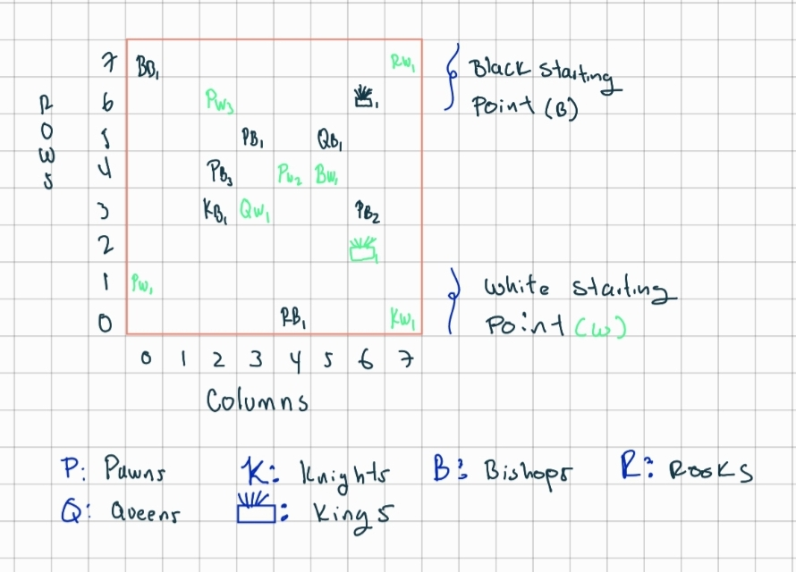

## Project 2: Chess Pieces
 

Introduction
A game of chess has several kinds of pieces: pawns, knights, bishops, rooks, queens and kings. 
These pieces are arranged on a chess board as shown in the figure below.

(Image taken from http://www.chess-game-strategies.com/images/kqa_chessboard_large-picture_2d.gif)Links to an external site.

A cell on the board is specified by a (row, column) tuple: rows increasing from bottom to top and columns increasing from left to right. 
Traditionally, the black pieces are arranged in the top two rows as shown.

Each chess piece can move in a specific way. In addition to moving, each chess piece can also kill a chess piece of the opposite colour if it moves to its place. The rules for each chess piece are as follows:

- Bishop: A bishop can only move diagonally, and kill any opponent’s piece if it can move to its place.
- Knight: A knight can move only in an L pattern: two cells horizontally and one vertically or vice versa. It can kill any opponent’s piece if it can move to its place.
- Rook: A rook can move horizontally or vertically. It can kill any opponent’s piece if it can move to its place.
- Queen: A queen can move horizontally, vertically and diagonally. It can kill any opponent’s piece if it can move to its place.
- King: A king can move one square in any direction (horizontally, vertically, or diagonally). It can kill any opponent’s piece if it can move to its place.
-Pawn: A pawn is interesting: it can move only “ahead,” not backwards towards where its color started. It can move only one place forward in its own column (except the first time it moves: it can move one or two places forward). However, to kill it must move one place forward diagonally (it cannot kill by moving straight).
 

More information on the movement of chess pieces hereLinks to an external site. and hereLinks to an external site..

 

What does this implemention do?
It designs and implements classes that represent the above chess pieces. 
These classes are named exactly as their names above, and all of them implement the ChessPiece interface
The package is named chess.

Each chess piece is be able to:

(a) return its current position on the chess board, as methods getRow() and getColumn() 
(b) return its color as an enum Color, using getColor()
(c) determine if it can move to a given cell, as a method canMove(int row, int col)
(d) determine if it can kill a provided piece starting from where it currently is, as a method canKill(ChessPiece piece)

In addition, each chess piece has a constructor that takes in an initial position as a row and column, and a color as an enum Color with values BLACK and WHITE. 
All rows and columns begin with 0. Rows decrease in number from top to bottom and Column from left to right the above chessboard.

### Test Board

This implementation includes a test directory. In order of testing this implementation, we have created a random allocation for each piece, the following
represents a diagram for this. 

This will help the user to visually understand the position of each tested piece. 

As an example the position ok the Black King is (1,6); Which indicates this is located at row 6 column 6. 

